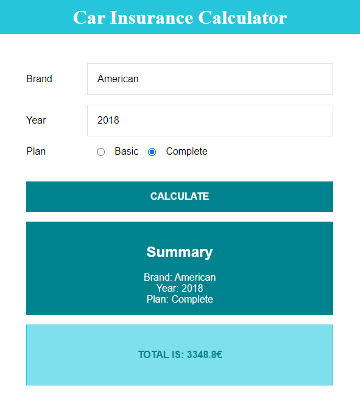

# Insurance Calculator
### Description 💰💸

Simple React project to calculate car insurance depending, on model, year and plan.

## Start the app 🚀

Instructions to get a copy of the working project on your local machine for development and testing purposes.

### Requirements 📋

* Fork this repo.
* Clone this repo.
* npm i && npm start

## DEMO 💻 

LIVE DEMO:

https://insurance-calculator-react.netlify.app/

## Built with 🛠️

-HTML5
-CSS3
-JavaScript
-React.js
-React Transition Group
-Styled Components
-Netlify
